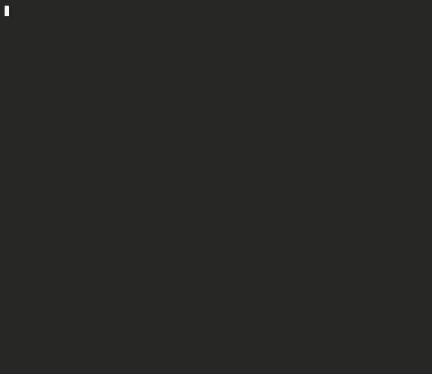

# Regulatory Affairs Knowledge Graph

**{{N}} nodes. {{M}} edges. Regulations, authorities, submissions, approvals, and products from {{K}} regulatory sources.**



> Part of the **Samyama** ecosystem — loaded into and queried via the graph engine at [samyama-ai/samyama-graph](https://github.com/samyama-ai/samyama-graph).
> This repo holds the loader and source-data specifics for the KG.

<a href="LICENSE"></a>

---

We loaded {{SOURCES}} into one graph, then asked:

> *"Which regulatory authority has the most pending submissions?"*

```cypher
MATCH (s:Submission)-[:SUBMITTED_TO]->(a:Authority)
WHERE s.status = 'pending'
RETURN a.name, count(s) AS pending
ORDER BY pending DESC LIMIT 5
```

**One query across every authority and submission.** Powered by [Samyama Graph](https://github.com/samyama-ai/samyama-graph).

---

## Demo

A narrated walkthrough on a fast, real subset: load -> submissions by authority -> approval timelines -> regulations a product must comply with.

```bash
python -m demo.demo                                                     # run live
asciinema rec --overwrite --cols 92 --rows 32 --idle-time-limit 2.0 \
  -c "bash -c 'python -m demo.demo'" demo/regulatory-affairs.cast        # re-record
agg demo/regulatory-affairs.cast demo/regulatory-affairs.gif            # convert to gif
```

---

## Schema

**Node labels** -- Regulation, Authority, Submission, Approval, Product, Requirement
**Edge types** -- ISSUED_BY, SUBMITTED_TO, GRANTED_APPROVAL, GOVERNS, REQUIRES, COMPLIES_WITH
**Data sources** -- {{SOURCES}}

See [`schema/regulatory_affairs_kg.cypher`](schema/regulatory_affairs_kg.cypher) for the full schema.

## Quick Start

```bash
python -m venv .venv && source .venv/bin/activate
pip install -e .

python -m etl.download_data          # fetch source data into data/
python -m etl.loader                 # build + load the graph
python -m mcp_server.server          # expose the KG over MCP
pytest                               # run tests
```

## Structure
```
etl/          # downloaders + graph loader
schema/       # cypher schema / ontology
mcp_server/   # MCP server exposing the KG
demo/         # narrated demo (cast + gif)
benchmarks/   # benchmark queries
docs/         # design + source notes
tests/        # pytest
pyproject.toml
```

---
_New track scaffolded from the KG template pattern. Replace the `{{...}}` placeholders and the schema/loaders for the regulatory-affairs sources._
